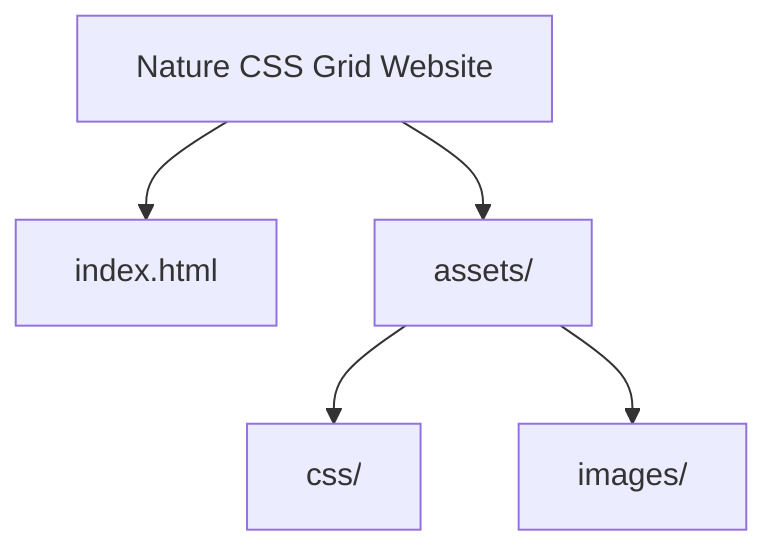

# 📌 Nature CSS Grid


Nature CSS Grid is a **static website** built with HTML and CSS.
It showcases a **nature-inspired design** using **CSS Grid layout** to highlight responsiveness and clean structure.

🌐 **Live Demo:** [Visit Nature CSS Grid](https://inaumanmajeed.github.io/Nature-CSSGrid/)

---

## ⚡ Tech Stack

* **HTML5** – Structure & semantic markup
* **CSS3 (Grid & Flexbox)** – Styling & responsive design
* **GitHub Pages** – Hosting platform

---

## 🚀 Getting Started

### 🔹 Run Locally

1. Clone the repository:

   ```bash
   git clone https://github.com/inaumanmajeed/Nature-CSSGrid.git
   cd Nature-CSSGrid
   ```
2. Open `index.html` in your browser.

### 🔹 Optional (Run with Local Server)

```bash
# Python 3
python3 -m http.server 8000
```

Visit: `http://localhost:8000`

---

## 📈 Roadmap / Improvements

* [ ] Add hover effects for interactive elements
* [ ] Enhance mobile responsiveness
* [ ] Add accessibility features (alt text, ARIA labels)
* [ ] Optimize images (compression & lazy loading)
* [ ] Add smooth animations for section transitions

---

## 🤝 Contribution Guide

1. Fork the repo
2. Create your branch (`feature-new`)
3. Commit changes
4. Push to branch
5. Open Pull Request

---

## 📜 License

This project is licensed under the [MIT License](./LICENSE).

---

## 👨‍💻 Author

**Nauman Majeed**
[](https://github.com/inaumanmajeed)
[](https://www.linkedin.com/in/inaumanmajeed/)

---

# 📊 Visual Overview



---

Do you want me to now go through **all your repos one by one** and prepare README files in this **exact MozaikPartners pattern**, so you’ll have a consistent portfolio style?
